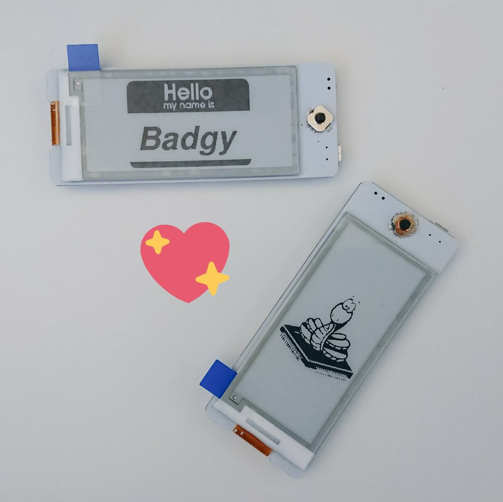

## Instructions
1. Follow this guide to install MicroPython on Badgy [Getting started with MicroPython on the ESP8266](https://docs.micropython.org/en/latest/esp8266/tutorial/intro.html)
   1. Download the [CP210x drivers](https://www.silabs.com/products/development-tools/software/usb-to-uart-bridge-vcp-drivers).
   1. Download [MicroPython 1.11 firmware](http://micropython.org/resources/firmware/esp8266-20190529-v1.11.bin)
   2. Install esptool.
      ```
      pipenv shell
      pip install esptool
      ```
   3. Erase existing firmware. (Change port as needed.)
      ```
      esptool.py --port /dev/tty.SLAB_USBtoUART erase_flash
      ```
   4. Flash new firmware. (Reduce baud rate if needed.)
      ```
      esptool.py --port /dev/tty.SLAB_USBtoUART --baud 460800 write_flash --flash_size=detect 0 esp8266-20190529-v1.11.bin
      ```
   5. Connect to REPL via serial port.
      ```
      picocom /dev/tty.SLAB_USBtoUART -b115200
      ```
   6. Enable WebREPL.
      ```
      import webrepl_setup
      ```
2. Install [ampy](https://learn.adafruit.com/micropython-basics-load-files-and-run-code/install-ampy) or use the [WebREPL](https://micropython.org/webrepl/) for uploading files
3. Upload [main.py](main.py), [image.py](image.py), and [epaper2in9.py](epaper2in9.py)
4. Reset Badgy and see the image!



## Next Steps
* Check out this [library](https://github.com/mcauser/micropython-waveshare-epaper) by [@mcauser](https://github.com/mcauser) for more examples and function calls
* We'll be adding more examples shortly!
